# Video Presentation 

# Introduction / Background
Banks and financial institutions act as money lenders and provide loans, as well as credit lines for millions of customers worldwide. However, for them to operate in a profitable manner and reduce the risk of their customers defaulting on payments for loans, they have to be able to accurately assess an individual's potential to default on their credit (in general, their overall credibility). This is also highly beneficial for them to determine the amount of interest that they should be charging on a given loan, and overall, whether they should offer the loan in the first place. This project is based around building a binary classification model that can be used to predict whether a borrower will default on their loan (meaning that they are unable to pay back a loan provided by a financial institution). A review of relevant literature showed us that privately securitized adjustable-rate mortgages have much more variance in performance when compared to retained mortgages, underscoring the importance of providing financial institutions with the best tools to aid decision making processes [(Krainer & Laderman, 2013)](https://doi.org/10.1007/s10693-013-0161-7‌). Delving into the literature revolving around this topic also greatly helped influence decisions made for this report, which will be elaborated on further in later sections.

For this project, our team opted to use the dataset provided by the Home Credit Group from a Kaggle competition. This data set has over 100 features about loan applicants and their credit risk. The dataset can be found at [this link](https://www.kaggle.com/c/home-credit-default-risk/data). In later sections, we discuss how we processed, cleaned, and reduced the data set to create a binary classification model to determine if applicants will default or not.

# Problem Definition
In today's volatile housing market, numerous potential borrowers face challenges in securing loans, often hindered by limited or absent credit histories. This situation breeds opportunities for unscrupulous lenders to exploit such individuals, while traditional banks miss out on viable clients due to irregular assessment methods. Emphasizing the crucial need for accurate predictions of loan repayment, it's imperative to ensure that qualified borrowers aren't unjustly denied. Equally vital is the early identification of likely defaulters to avert financial losses. Relying solely on manual risk assessment is not only time-consuming but also subject to human biases and inconsistency. Therefore, the development of a model to categorize individuals based on their repayment risk is essential. Such a model can help financial institutions streamline the evaluation process, enhance consistency in risk assessment, and significantly lower the incidence of loan defaults.

# Data Collection
Our initial dataset for training the binary classification model, aimed at predicting home credit loan defaults, was extensive, comprising of hundreds of features (columns) and hundreds of thousands of instances (rows). This also primarily came from a singular file, `application_train.csv`. For this portion of the project, however, we focused on the features present in multiple files, rather than using a singular file, to add more features that were deemed important through manual and code analysis. This integrated relevant data from other files, such as information from credit bureaus. Recognizing the need for dimensionality reduction, after downloading and reading through the dataset and relevant descriptions, we had to clean up the data to prepare it for classification by our models. We completed the following steps, described below, to clean our data set:

1. **Data Cleaning and Feature Selection**: We initiated our process by identifying features with substantial missing data, specifically those with over 50% missing values. This criterion led to the elimination of several columns, primarily consisting of incomplete data or binary flags, which were impractical for meaningful imputation. This decision aligns with practices recommended in [Bao et al. (2019)](https://doi.org/10.1016/j.eswa.2019.02.033) and [de Castro Vieira et al. (2019)](https://doi.org/10.1016/j.asoc.2019.105640), who both recommend against the use of substantial missing data, as filling in missing values can lead to data distortion, and that many missing data points can harm accuracy. Bao et al. specifically stated that their cleaning approach started with: "for the features not filled out by 95% of applicants or above, we removed this feature." These papers, along with other sources from our initial literature review and background research, underscore the importance of data quality and relevance in predictive accuracy.

2. **Validation of Feature Removal**: To validate our feature removal decisions, we utilized a Decision Tree Classifier. We opted to utilize this approach based on information supported by [Emad Azhar Ali et al. (2021)](https://doi.org/10.24867/ijiem-2021-1-272). This helped us confirm that the eliminated features had minimal impact on predicting loan defaults, ensuring the retained data's relevance and quality, while also highlighting features that might have significant relevance towards predicting an individual defaulting on a home loan. 

    ```python
    from sklearn.tree import DecisionTreeClassifier
    import matplotlib.pyplot as plt
    import pandas as pd

    def get_feature_imp(X_train, y_train):
        tree = DecisionTreeClassifier()
        tree.fit(X_train, y_train)
        importances = tree.feature_importances_
        feat_importances = pd.DataFrame(importances, index=X_train.columns, columns=["Importance"])
        feat_importances.sort_values(by='Importance', ascending=False, inplace=True)
        feat_importances.plot(kind='barh', figsize=(80,60))
    ```

    The above code generated the following plot, which can be viewed separately (with zoom capabilities) [by clicking here](resources/midterm/decision-tree-results.png "download"): 
    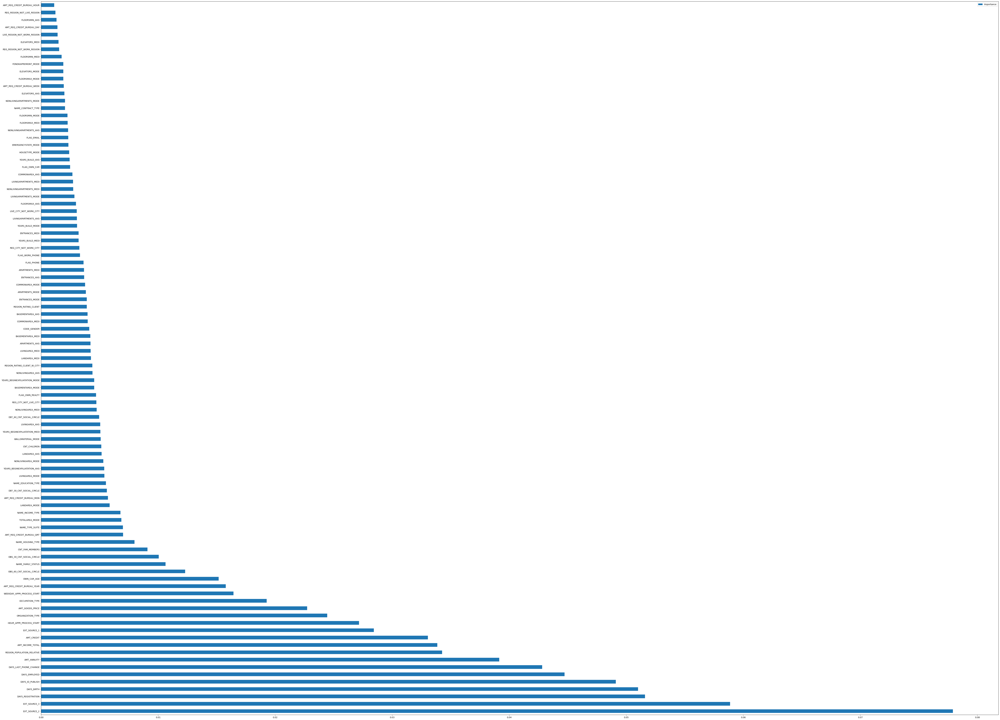

3. **Handling Categorical Data**: We then addressed the challenge of categorical data, transforming string or object data types into discrete numerical codes. This conversion is crucial for compatibility with machine learning algorithms, as noted in [Krainer and Laderman (2013)](https://doi.org/10.1007/s10693-013-0161-7‌). We utilized `pandas` for this approach. Furthermore, for the final iteration of this project, after we transformed the categorical data into discrete numerical codes, we decided to one-hot encode the data, as it is a common practice in machine learning to one-hot encode categorical data. This is because one-hot encoding allows for the data to be represented in a way that is more easily understood by machine learning algorithms. This added many features to our dataset for the final version of this report, but we felt that it will help improve the accuracy of our models.

4. **Imputation of Missing Values**: For the remaining features, our strategy for handling missing values varied based on the feature context. For instance, null values in 'OWN_CAR_AGE' were interpreted as the absence of a car and replaced with zeros. This approach of context-sensitive imputation is supported by [Bao et al. (2019)](https://doi.org/10.1016/j.eswa.2019.02.033), emphasizing the importance of maintaining data integrity.

5. **Advanced Imputation Techniques**: For features where zero imputation was inappropriate, we initially applied `sklearn`’s SimpleImputer with -1 as a placeholder. Recognizing the limitations of this naive approach, we plan to explore more sophisticated methods, such as the K-Nearest Neighbors (KNN) imputer. However, our trial with KNN imputation proved time-consuming (the runtime was taking far too long, eliminating it from consideration). That being said, its potential for more accurate imputation, as suggested by [de Castro Vieira et al. (2019)](https://doi.org/10.1016/j.asoc.2019.105640). We attempted to use the KNN imputation once more for the final portion of this project, but the runtime constraints were too much for our computers to handle within the time constraints of the project implementation - we also ran into several issues and errors that we weren't able to debug despite our best efforts. That said, our group hopes to spend a bit of free time in the future to explore this method further, as it seems to be a promising approach to imputation.

6. **Dimensionality Reduction with PCA and Data Normalization**: Prior to applying Principal Component Analysis (PCA), an unsupervised learning method for this project, we utilized the StandardScaler from `sklearn` for data normalization. We originally used the RobustScaler for the first iteration of this project with the midterm report. StandardScaler is often preferred over RobustScaler for PCA as it aligns with PCA's sensitivity to outliers and assumption of Gaussian distribution. It scales data based on mean and standard deviation, ensuring that PCA captures the true variance, including outliers' influence. In contrast, RobustScaler, focusing on the median and interquartile range, might not fully represent the data's variance structure as required by PCA. Thus, StandardScaler better maintains the data's integrity for PCA analysis. This scaling approach, therefore, enhances the effectiveness of PCA, which we applied to reduce our feature set from 257 components to 192 principal components. By doing this reduction, we captured 99% of the variance in the dataset, striking an optimal balance between dimensionality reduction and information retention, as recommended by [Emad Azhar Ali et al. (2021)](https://doi.org/10.24867/ijiem-2021-1-272). This balance is crucial in machine learning, as it preserves essential data characteristics while reducing computational complexity. Finally, we divided our dataset using an 80/20 training-test split using `sklearn`, following a standard practice for evaluating model performance in machine learning.

This comprehensive data preparation process ensures a robust, relevant, and efficient dataset, ready for deploying in our binary classification model to predict home credit loan defaults.

# Data Visualizations
To help us understand the dataset better, we plotted many features using `pandas` and `plotly`. First, we wanted to determine the balance of our dataset for the binary classification, so we examined the number of non-defaults, 0, and the number of defaults, 1.

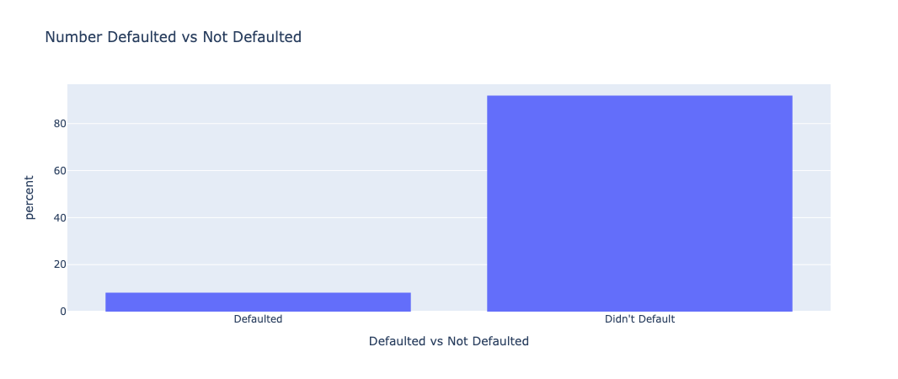

This chart shows that the dataset is heavily skewed in favor of people who didn't default on their loans, which is representative of the real world. That implies that high accuracy results aren't necessarily a sign of a working algorithm, and that we would need to use other metrics to make sure our models work properly.

--- 

We then wanted to examine the income distribution of the individuals who were represented in the data set. 

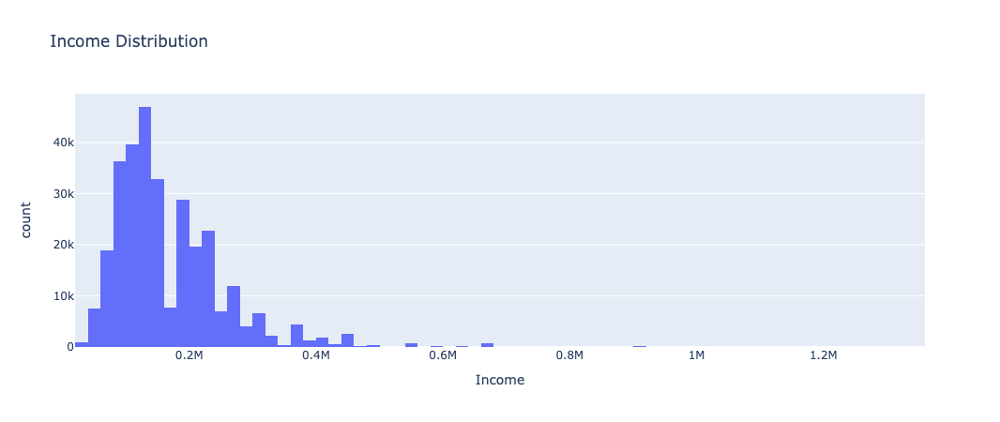

This chart just shows the income distribution of our dataset, without some heavy outliers with an absolute z-score of 5 or higher. The distribution matches up with a generic population distribution of incomes, which shows that our dataset is a good representation of larger populations.

The following charts are overlayed histograms which divide the data by default status, with the orange being those who did default and the blue representing those who didn't default. All of the charts are normalized around the likelihood of any datapoint landing in a certain bin given a person's default status, as just measuring the total count isn't very useful since so many more people didn't default than those who did. The dataset also included credit ratings and history from other external sources (**EXT_SOURCE_1, EXT_SOURCE_2, EXT_SOURCE_3**), and we knew that we wanted to explore these features more to understand their impact on classifier results:

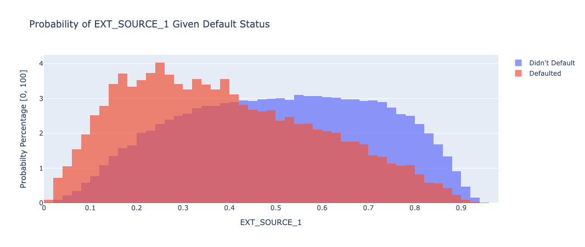
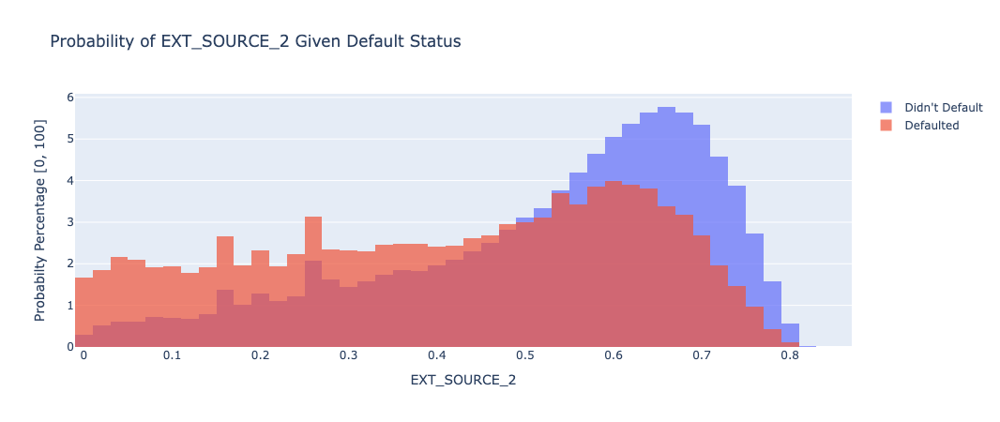


**EXT_SOURCE_1**: This chart shows that the EXT_SOURCE_1 metric predicts a higher value for those who are less likely to default, and does a fairly good job of splitting the data, although it's a very gradual split.

**EXT_SOURCE_2**: This chart shows that the EXT_SOURCE_2 metric predicts a higher value for those who are less likely to default, and can predict the likelihood of not defaulting pretty well, though it has a more uniform distribution for those who did end up defaulting.

**EXT_SOURCE_3**: EXT_SOURCE_3 also predicts a higher value for those who are less likely to default, and follows a similar distribution to EXT_SOURCE_1, with a higher emphasis on those who didn't default.

--- 

Aside from external sources, we also found some metrics that have relationships with default status. These plots are shown below:

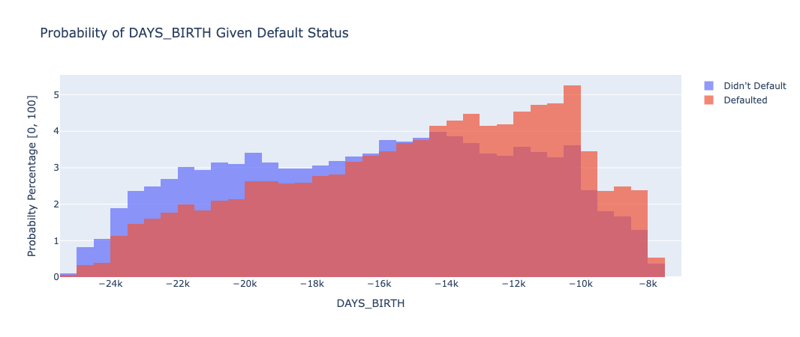

The amount of days since your birth seems to directly relate to a person's default status. The more days since you were born (the older you are), the less likely it seems you are to default.

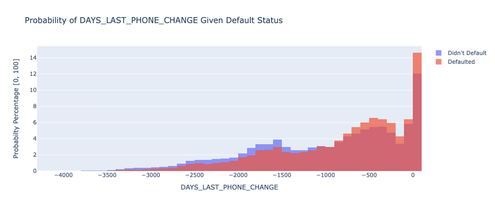

--- 

Finally, we examined some demographics and and general information regarding each of the individuals included in the data set. Some significant or interesting plots of the data are shown below: 

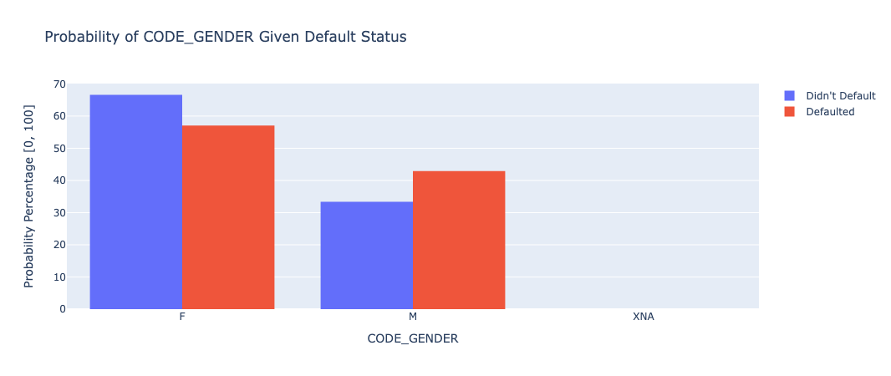

The graph shows that there are more people who identified as female in the dataset, and overall, males were more likely to default on their loans.

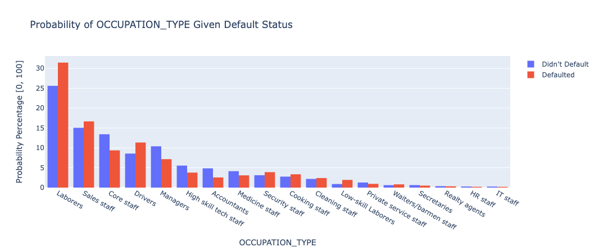

Overall, people with occupations which usually pay more seemed to default significantly less. Those occupations include: core staff, managers, high skill tech staff, accountants, medicine staff, and private service staff. The rest of the occupations were either about even or had higher proportions of people who defaulted.

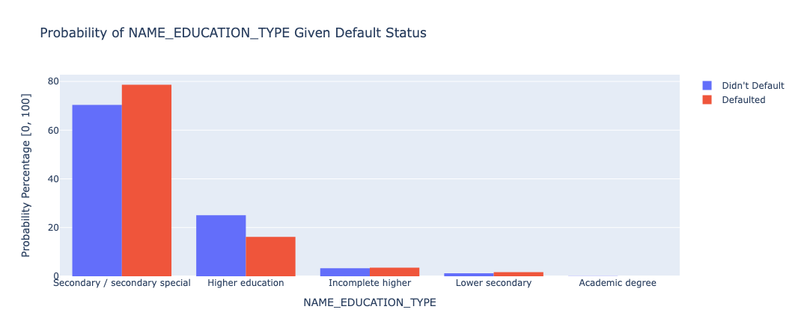

Similar to occupation, people with a higher level of education ended up comprising a smaller portion of those who defaulted on their loans.

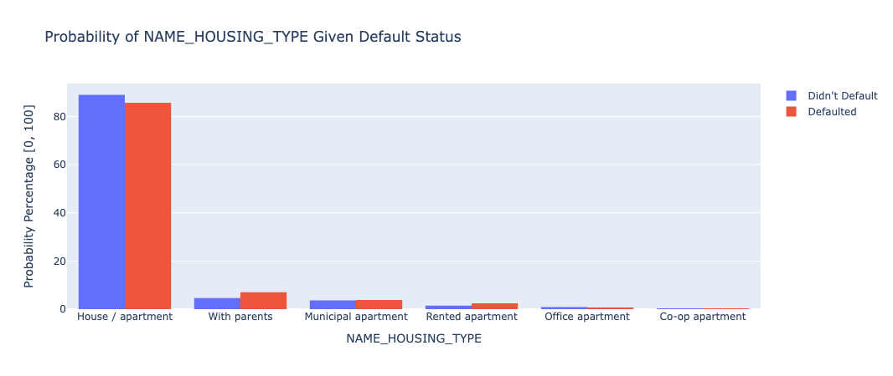

Those who live in their own housing comprise a relatively smaller proportion of those who defaulted than those who didn't, while almost every other housing type did the opposite.

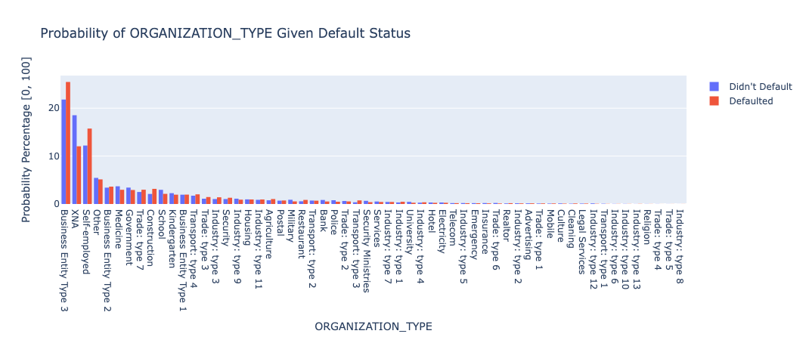

This dataset is harder to analyze as there are a lot of categories that divide the data, but it also displays the different organizations people are in and what percentage of those who defaulted and those who didn't came from each type of organization.

Overall, these visualizations helped our group understand the data set better, give us insights into important features, and how to best prepare them for classification.

# Methods
After rigorously cleaning and processing our dataset, we advanced to the phase of training classifiers and generating predictions on the test data set aside for validation. We selected three distinct classifiers for this task: the Support Vector Classifier (SVC), the Logistic Regression Classifier (LR), and the Random Forest Classifier (RF). The choice of SVC and Logistic Regression was strategic, given their proven efficacy in binary classification problems. These models are well known for their ability to handle high-dimensional data efficiently and are less prone to overfitting, especially relevant given the size of our dataset. This consideration is crucial, as models like Neural Networks, while powerful, typically require substantially larger datasets to perform effectively and were thus deemed unsuitable for our current data volume. With regards to our SVC, we opted to use a Stochastic Gradient Descent (SGD) optimizer, as it greatly improved the runtime efficiency while also giving similar results in terms of metrics that we observed. Out of pure curiosity, we decided to also test using another classifier, the Random Forest classifier, as it is a popular choice for classification problems and is known to be a powerful classifier. We also wanted to see how it would compare to the other two classifiers we chose.

To ensure the best possible performance of each classifier, we applied appropriate feature scaling techniques. Though we used the RobustScaler for the midterm report, we decided to use the MinMaxScaler for the classifiers, as the RobustScaler may have caused a loss of information by changing the distribution. On the other hand, the MinMaxScaler primarily scaled the data, thus preventing a lossy conversion. We employed this MinMaxScaler for each of our classifiers, which we found to be a great change from the midterm portion of this project. 

Upon training both classifiers on the training data, we employed the balanced accuracy metric to evaluate their performance on the unseen test data. Balanced accuracy is an appropriate choice for our dataset, especially if the class distribution is imbalanced, as it takes into account the true positive rate and the true negative rate, providing a more nuanced understanding of model performance across both classes. For the final portion of this report, we also opted to examine other metrics, including the F1 score, precision score and a confusion matrix. These metrics are all important to consider when evaluating the performance of a classifier, and we wanted to make sure that our models were performing well across all of these metrics. The F1 score, as the harmonic mean of precision and recall, is a crucial metric for models where it's important to balance the rate of correct positive predictions with the ability to identify all positives. Precision score is vital in scenarios where the cost of false positives is high, as it reflects the accuracy of positive predictions. Together, these metrics provide a comprehensive view of a model's performance, especially in imbalanced datasets where traditional accuracy might not be indicative.

We also messed around with the hyperparameters of each classifier to see if we could improve the performance of our models. We tried using `sklearn`'s hyperparameter tuning methods to find the best hyperparameters for each classifier, but we found that the runtime was too long for our computers to handle within the time constraints of the project implementation. That said, we did find some hyperparameters that worked well for each classifier, and we used those for the final portion of this project. 

Finally, we also wanted to see how we could combine the three models together into a better model, so we used `sklearn`'s VotingClassifier to combine the three models together. We found that this model did not have a significant improvement over the other models, but it was interesting to examine. The code for each of the descirbed classifiers is shown below. 

```python
    def fit_svm_classifier(X, y):
        pipeline = make_pipeline(MinMaxScaler(), SGDClassifier(loss="hinge", random_state=0, class_weight="balanced", max_iter=10000))
        pipeline.fit(X, y)
        return pipeline

    def fit_lr_classifier(X, y):
        pipeline = make_pipeline(MinMaxScaler(), LogisticRegression(C=2, random_state=0, class_weight="balanced", max_iter=10000))
        pipeline.fit(X, y)
        return pipeline

    def fit_random_forest_classifier(X, y):
        pipeline = make_pipeline(MinMaxScaler(), RandomForestClassifier(max_depth=10, random_state=0, class_weight="balanced"))
        pipeline.fit(X, y)
        return pipeline

    def fit_voting_classifier(X, y):
        svm_pipeline = make_pipeline(MinMaxScaler(), SGDClassifier(loss="log_loss", random_state=0, class_weight="balanced", max_iter=10000))
        lr_pipeline = make_pipeline(MinMaxScaler(), LogisticRegression(C=2, random_state=0, class_weight="balanced", max_iter=10000))
        rf_pipeline = make_pipeline(MinMaxScaler(), RandomForestClassifier(max_depth=10, random_state=0, class_weight="balanced"))
        pipeline = VotingClassifier(estimators=[('svm', svm_pipeline), ('lr', lr_pipeline), ('rf', rf_pipeline)], voting='soft')
        pipeline.fit(X, y)
        return pipeline
```
    
The results and metrics for each of the models we trained are shown in the next section. 

# Results and Discussion
The classification task at hand presents an inherent class imbalance, a common obstacle in credit prediction scenarios where defaults are considerably less frequent than non-defaults. To aptly measure model efficacy, we opted for balanced accuracy over raw accuracy, as it accounts for the skew in class distribution. Balanced accuracy offers a more nuanced assessment by considering the model's ability to correctly predict both classes.

Our initial model, a baseline majority class classifier, predicted a non-default for all instances, achieving a 50% accuracy, which is expected in a binary classification with imbalanced classes. Upon applying the Support Vector Classifier (SVC) post-normalization with the StandardScaler and SGD Optimization, the balanced accuracy improved to 65.3%. This notable enhancement over the baseline underscores the model's improved discriminatory power. The SVC's confusion matrix reveals a tendency to predict non-defaults more accurately (83%) compared to defaults (48%). This showed a significant improvement in our predicting non-defaults as compared to our previous results. There is still great room for improvement with predicting defaults accurately, as the true positive rate for defaults was lower than we had initially hoped. The confusion matrix is shown below, and can be viewed separately [by clicking here](resources/final/svc-confusion-matrix.png "download"): 

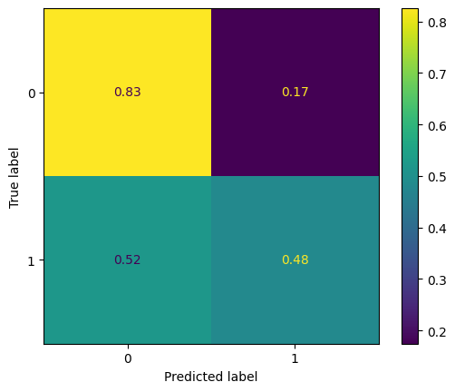

For the SVC, a high F1 score of around 0.833 demonstrates a robust balance between precision and recall, indicating that the classifier not only correctly identifies a high proportion of positive cases (precision of about 0.887) but also labels a high percentage of actual positives correctly. This high precision score is particularly notable, as it implies that the model has a low rate of false positives, which is crucial in many applications where the cost of a false positive is high. Overall, these metrics collectively suggest that the SVM model is effective in distinguishing between classes while maintaining a low rate of misclassification. This model saw great improvements from the midterm portion of this project, and we were very happy with the results we were able to achieve.

The Logistic Regression Classifier (LR) also demonstrated a notable improvement over the baseline, achieving a balanced accuracy of 68%. This saw a huge leap from our initial implementation of the midterm report, which saw a balanced accuracy of only 53.3%. This model's confusion matrix reveals a tendency to predict defaults and non-defaults in a more balanced manner, as compared to SVC (68% for both defaults and non-defaults). This showed a significant improvement in our predictions as compared to our previous results.  The confusion matrix is shown below, and can be viewed separately [by clicking here](resources/final/lr-confusion-matrix.png "download"):


The performance metrics that we examined for this portion of the project for the Logistic Regression classifier suggest it is quite effective. The F1 score, at around 0.755, shows a solid balance between precision and recall, implying the model is reasonably accurate in identifying true positives while minimizing false negatives. Moreover, the high precision score of about 0.895 is particularly impressive, indicating that the classifier has a high success rate in correctly identifying positive cases and a low rate of false positives. This high precision is crucial in contexts where false positives can be costly or detrimental. Overall, these metrics suggest that the Logistic Regression model performs well in class differentiation with a strong emphasis on accurate positive predictions.

Finally, we decided to examine our Random Forest Classifier out of pure interest. This saw a balanced accuracy of 63.1%, which was modest in comparison to the balanced accuracies of our SVC and LR models. This model's confusion matrix reveals a tendency to predict defaults and non-defaults in a less balanced manner, similar to what we saw with our SVC model (84% for defaults, 43% for non-defaults). This showed a decent jump from the baseline.  The confusion matrix is shown below, and can be viewed separately [by clicking here](resources/final/rf-confusion-matrix.png "download"):

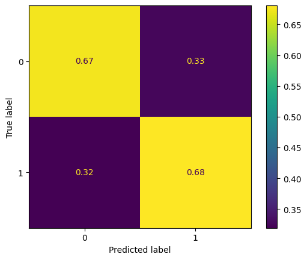

The performance metrics for the Random Forest classifier indicate a competent level of effectiveness in classification. The F1 score, at approximately 0.836, suggests a strong balance between precision and recall, indicating that the model is effective in correctly identifying a high proportion of actual positive cases while maintaining a low rate of false negatives. Additionally, the precision score of about 0.882 highlights the model's accuracy in predicting positive instances, meaning it has a relatively low frequency of false positives. This high precision is especially valuable in situations where incorrectly labeling negative instances as positive could be problematic. Overall, these metrics suggest that the Random Forest classifier is a robust model, capable of effectively distinguishing between classes with a high degree of accuracy in its positive predictions.

# Team Contributions

## Contribution Table

## Project Timeline and Gantt Chart

---

# References

1. Bao, W., Lianju, N., & Yue, K. (2019). Integration of unsupervised and supervised machine learning algorithms for credit risk assessment. Expert Systems with Applications, 128, 301–315. https://doi.org/10.1016/j.eswa.2019.02.033
2. de Castro Vieira, J. R., Barboza, F., Sobreiro, V. A., & Kimura, H. (2019). Machine learning models for credit analysis improvements: Predicting low-income families’ default. Applied Soft Computing, 83, 105640. https://doi.org/10.1016/j.asoc.2019.105640
3. Emad Azhar Ali, S., Sajjad Hussain Rizvi, S., Lai, F.-W., Faizan Ali, R., & Ali Jan, A. (2021). Predicting Delinquency on Mortgage Loans: An Exhaustive Parametric Comparison of Machine Learning Techniques. Vol12 - Issue 1, Volume 12(Issue 1), 1–13. https://doi.org/10.24867/ijiem-2021-1-272
4. Krainer, J., & Laderman, E. (2013). Mortgage Loan Securitization and Relative Loan Performance. Journal of Financial Services Research, 45(1), 39–66. https://doi.org/10.1007/s10693-013-0161-7‌
